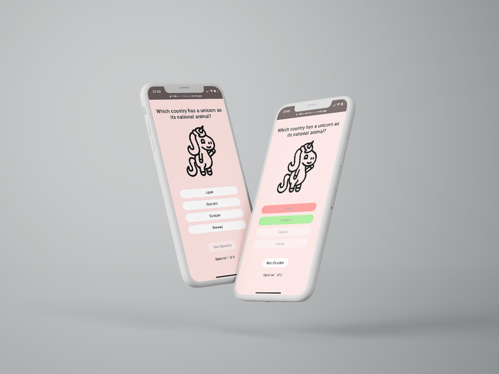

# Redux quiz project&ensp;|&ensp;[View Live &#10132;](https://hello-countries-quiz.netlify.app/)

An introduction to React Redux as well as a developer team practice. As a smaller group we created a quiz from a pre-defined reducer, a practice in interacting with the Redux store using selectors and dispatching actions.

The project was done with mob-programming using VS Code Live View.

## Core Tech

- React
- React Redux
- Redux Toolkit
- Styled components
- Lottie animations
- Mob Programming

## View it live

https://hello-countries-quiz.netlify.app/
